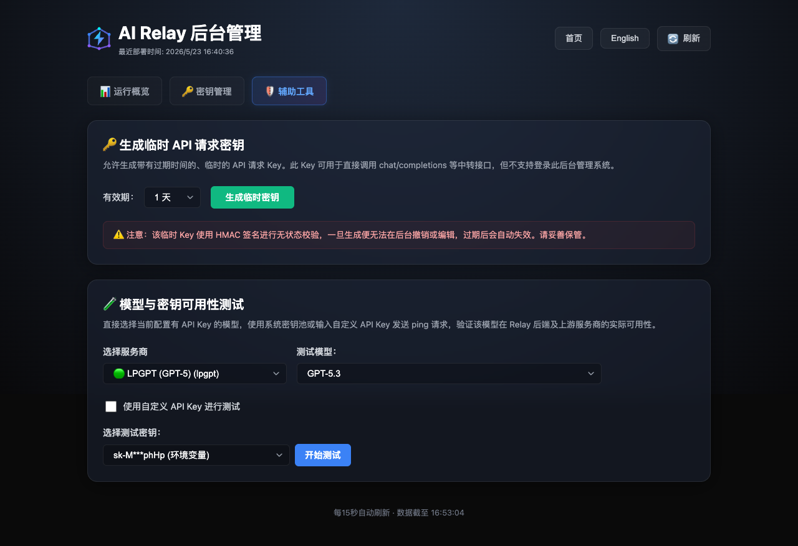

<div align="center">


**你的个人 AI API 网关 — 云端一键部署，本地 CLI 运行，统一管理所有大模型接口**

<p>
  <a href="https://vercel.com/new/clone?repository-url=https://github.com/MoyuFamily/ai-relay&env=RELAY_API_KEY,RELAY_ADMIN_KEY,RELAY_SIGNING_SECRET&envDescription=API%20authentication%20keys%20(required%20for%20security)&envLink=https://github.com/MoyuFamily/ai-relay#-快速开始">
    
  </a>
  &nbsp;
  <a href="#-部署到-cloudflare-pages">
    
  </a>
  &nbsp;
  <a href="#-本地运行cli">
    
  </a>
</p>

[](CHANGELOG.md)
[](LICENSE)

[English](README_EN.md) · [中文](README.md)

</div>

---

> **一个网关，管理所有 AI 接口。**
>
> 把 OpenAI、Claude、DeepSeek 等多个 Provider 的 API Key 统一接入，通过一个端点对外服务。
> 自动轮换 Key、故障转移、熔断保护，不用写一行胶水代码。
>
> 三种部署方式，按需选择：
> - ☁️ **Vercel / Cloudflare** — 2 分钟云端上线，零服务器
> - 💻 **本地 CLI** — `airelay local:start` 一行命令，不消耗云端额度
> - 🔧 **本地开发** — `npm run dev`，改代码即生效

### 谁该用哪个？

| | ☁️ Vercel | ☁️ Cloudflare | 💻 本地 CLI |
|---|---|---|---|
| **适合谁** | 轻量用户、快速试用 | 编码重度用户 | Agent / 多模态 / 高阶用户 |
| **月请求量** | 中低频（月 Token < 5 亿） | 高频（日均数万次编码调用） | 不限，取决于网络带宽 |
| **Token 统计** | 采样统计（可配采样率） | 采样统计（CF CPU 预算限制） | **精确统计**（SQLite 逐条记录） |
| **部署形态** | Edge Serverless，冷启动 < 50ms | Edge Worker，全球分发 | 本机常驻进程，无冷启动 |
| **存储** | Upstash Redis（KV） | Cloudflare D1 + KV | 本地 SQLite |
| **典型场景** | 个人日常对话、轻量 API 中转 | Copilot / Cursor 高频编码调用 | Codex / Claude Code 本地 Agent、大图/视频多模态、密钥本机化 |
| **核心限制** | 免费层有流量和存储上限，高并发/多模态场景会触顶 | CF Worker CPU 时间受限，长响应需优化 | 需要自己保持进程运行 |

> **⚠️ Vercel Hobby 使用建议：**
> - **适合**：个人日常对话、轻量 API 中转、开发调试阶段
> - **不适合**：高频编码调用（如 Copilot/Cursor 连续使用）、大图/视频等多模态场景、长时间推理任务
> - 免费层的存储和流量资源有限，项目已实现用量采样统计来缓解压力；多 Key 轮换和用量采样参数均可在管理后台调整
>
> 编码重度用户建议直接用 Cloudflare，Agent 和多模态场景建议本地 CLI。

> **一句话选择：** 用 Vercel 起步体验，编码多就切 Cloudflare，跑 Agent 或多模态就上本地 CLI。三种方式共用同一套配置和 API，随时可以迁移。

## 🎯 为什么选 AI Relay

| | 说明 |
|---|---|
| **无服务器** | 不买服务器、不装 Docker、不运维 — Vercel / Cloudflare 一键部署，2 分钟上线 |
| **零成本启动** | 免费层即可跑起来，个人开发者不用花一分钱 |
| **一个端点搞定** | 兼容 OpenAI SDK，现有代码只改 `base_url`，零改动迁移 |
| **多 Key 多 Provider** | 自动轮换、故障转移、熔断保护，内置容灾能力 |
| **三种部署形态** | 云端 Serverless / 本地 CLI / 开发模式，同一套配置、同一个 API |

## 🚀 快速开始

### ☁️ 一键部署到 Vercel（推荐新用户）

> 前置条件：[Vercel 账号](https://vercel.com/signup)（免费）+ 至少一个 AI Provider 的 API Key

1. 点击上方 **Deploy with Vercel** 按钮，填入 3 个环境变量：

| 变量 | 说明 |
|------|------|
| `RELAY_API_KEY` | 客户端鉴权密钥（自定义强密码） |
| `RELAY_ADMIN_KEY` | Admin 后台登录密钥（可同上） |
| `RELAY_SIGNING_SECRET` | 临时 Key 签名密钥（可同上） |

2. 部署完成后，在 Vercel Dashboard → **Storage** → 创建 **Upstash for Redis**（Free 套餐）→ 关联项目
3. 访问 Admin 后台添加 Provider Key，开始调用：

```bash
curl -X POST https://你的项目.vercel.app/v1/chat/completions \
  -H "Authorization: Bearer YOUR_RELAY_API_KEY" \
  -H "Content-Type: application/json" \
  -d '{"model": "gpt-5.4", "messages": [{"role": "user", "content": "你好！"}]}'
```

<details>
<summary><strong>☁️ 部署到 Cloudflare Pages</strong></summary>

**前置条件：** [Cloudflare 账号](https://dash.cloudflare.com/sign-up)（免费）+ GitHub 仓库

> ⚠️ 必须先配置 GitHub Secrets，否则部署会失败。

**第 1 步 — Fork 仓库并配置 GitHub Secrets**

在仓库 **Settings → Secrets and variables → Actions → Repository secrets** 中添加：

| Secret | 说明 | 必填 |
|--------|------|------|
| `CLOUDFLARE_API_TOKEN` | CF API Token（Pages:Edit + D1:Edit + KV:Edit） | ✅ |
| `CLOUDFLARE_ACCOUNT_ID` | CF 账号 ID | ✅ |
| `RELAY_API_KEY` | 客户端鉴权密钥 | ✅ |
| `RELAY_ADMIN_KEY` | Admin 登录密钥（可选，默认同上） | ⬜ |
| `RELAY_SIGNING_SECRET` | 临时 Key 签名密钥（可选，默认同上） | ⬜ |

<details>
<summary>如何获取 Cloudflare API Token</summary>

1. 访问 [Cloudflare Dashboard](https://dash.cloudflare.com/profile/api-tokens)
2. 点击 **Create Token** → **Create Custom Token**
3. 权限设置：Account → Cloudflare Pages / D1 / Workers KV Storage → Edit
4. 复制 Token

</details>

**第 2 步 — 推送触发部署**

推送到 `main` 分支，GitHub Actions 自动完成：D1 建表 → KV 创建 → 构建部署 → 环境变量配置。

**第 3 步 — 验证**

```bash
curl https://你的项目.pages.dev/health
# → {"status":"ok"}
```

> **存储说明：** CF 部署使用 D1（用量统计）+ KV（配置数据），免费层可支撑 3-5 万次请求/天。

</details>

<details>
<summary><strong>💻 本地运行（CLI）</strong></summary>

除了云端部署，AI Relay 提供本地 CLI 工具，在开发机上运行轻量 Relay 服务器，不消耗云端额度。

> 📖 完整文档：[CLI_GUIDE.md](CLI_GUIDE.md)

```bash
# 1. 克隆并安装
git clone https://github.com/MoyuFamily/ai-relay.git && cd ai-relay && pnpm install

# 2. 全局安装 CLI
npm link

# 3. 启动（支持 4 种配置方式）
airelay local:start                              # 本地配置文件
airelay local:start --config ./relay-config.json  # 指定配置文件
export OPENAI_KEYS="sk-xxx" && airelay local:start  # 环境变量
airelay login https://你的项目.vercel.app && airelay local:start  # 云端同步
```

**适用场景：** 本地开发调试 · 内网环境 · 临时测试 Provider · CI/CD 集成测试

</details>

<details>
<summary><strong>🔧 本地开发（Web 应用）</strong></summary>

```bash
git clone https://github.com/MoyuFamily/ai-relay.git && cd ai-relay
npm install
cp .env.local.example .env.local
# 编辑 .env.local 填入 API Keys
npm run dev  # http://localhost:3000
```

</details>


## ✨ 核心能力

**路由与容灾**
| 特性 | 说明 |
|------|------|
| 多 Provider 路由 | OpenAI · Claude · DeepSeek · MiMo · 自定义，统一端点接入 |
| 多 Key 轮换 | Round-Robin + 429 自动退避，单 Key 故障不影响服务 |
| 多级 Fallback | Provider → Key 链式故障转移，可配置恢复策略 |
| 熔断器 | Provider 连续故障时自动摘除，恢复后自动加回 |
| 智能路由 | 延迟优先 / 成本优先 / 可用性优先，自动选择最优 Provider |

**协议与兼容**
| 特性 | 说明 |
|------|------|
| OpenAI 兼容 | `/v1/chat/completions` · `/v1/responses` · 流式 SSE，直接用 OpenAI SDK |
| Anthropic 原生 | `/v1/messages` 端点，Claude 客户端直连无需转换 |
| 虚拟模型映射 | 将虚拟模型名路由到真实 Provider，按需切换底层模型 |

**管理与监控**
| 特性 | 说明 |
|------|------|
| Admin 后台 | Web 管理界面，密钥管理、配额配置、用量统计、模型测试 |
| Provider 引导 | 三步式创建：选模板 → 配密钥 → 测试保存 |
| 模型别名 | CSV 批量导入导出、内联编辑、模型可见性控制 |
| 请求日志 | 实时请求追踪，支持内存 / KV / Postgres 多后端 |

**安全与通知**
| 特性 | 说明 |
|------|------|
| 临时 API Key | HMAC-SHA256 无状态签名，自动过期，适合 CI/CD |
| Key 安全管理 | 遮掩展示、健康监控、轮换告警、审计日志 |
| Webhook 通知 | 企微 / 飞书 / 钉钉 / Slack，日报 + 超限告警 |

**部署与运维**
| 特性 | 说明 |
|------|------|
| 零服务器 | Vercel Edge Runtime / Cloudflare Workers，全球分发 < 50ms |
| 双平台 | Vercel 一键部署；Cloudflare 通过 GitHub Actions 推送即部署 |
| 本地 CLI | `airelay local:start` 本地运行，云端配置同步，不消耗服务器额度 |
| 用量采样 | 可配置采样率，高并发场景降低 KV 写入压力 |

## 🏗️ 架构

```
                  ┌─────────────────────────────────────────┐
                  │           AI Relay Gateway               │
                  ├─────────────────────────────────────────┤
  Client ────────▶│  Edge Runtime                           │
  (OpenAI SDK)    │    ├─ 熔断器 + Fallback 链               │
                  │    ├─ Key 轮换 (Round-Robin + 429 退避)  │
                  │    ├─ 智能路由 (延迟/成本/可用性)          │
                  │    └─ 协议转换 (OpenAI ↔ Anthropic)      │
                  ├──────────┬──────────┬───────────────────┤
                  │  Vercel  │   CF     │  本地 CLI          │
                  │  Edge    │  Workers │  (airelay start)   │
                  │  + Redis │  + D1+KV │  + SQLite/KV      │
                  └──────────┴──────────┴───────────────────┘
                    ▼           ▼           ▼
                  OpenAI    Claude    DeepSeek    自定义 ...
```

## 📖 使用方法

### OpenAI SDK

```python
from openai import OpenAI

client = OpenAI(
    api_key="YOUR_RELAY_API_KEY",
    base_url="https://你的项目.vercel.app/v1"
)

# 普通调用
response = client.chat.completions.create(
    model="gpt-5.4",
    messages=[{"role": "user", "content": "你好！"}]
)

# 流式调用
stream = client.chat.completions.create(
    model="gpt-5.4",
    messages=[{"role": "user", "content": "讲个故事"}],
    stream=True
)
for chunk in stream:
    print(chunk.choices[0].delta.content or "", end="")
```

### Claude / Anthropic Messages API

```bash
curl -X POST https://你的项目.vercel.app/v1/messages \
  -H "x-api-key: YOUR_RELAY_API_KEY" \
  -H "anthropic-version: 2023-06-01" \
  -H "Content-Type: application/json" \
  -d '{
    "model": "claude-sonnet",
    "max_tokens": 1024,
    "messages": [{"role": "user", "content": "你好！"}]
  }'
```

### Responses API

```bash
curl -X POST https://你的项目.vercel.app/v1/responses \
  -H "Authorization: Bearer YOUR_R...KEY" \
  -H "Content-Type: application/json" \
  -d '{"model": "gpt-5.4", "input": "你好！", "stream": true}'
```

> Responses API 目前仅支持 OpenAI 格式的 Provider。


## 🏁 同类项目对比

| | AI Relay | OneAPI / new-api | FastGPT | OpenRouter |
|---|---|---|---|---|
| **部署方式** | 一键部署（Vercel / CF / 本地 CLI） | 自托管（Docker） | 自托管（Docker） | 纯 SaaS |
| **服务器成本** | **零**（免费层可跑） | 需要服务器 | 需要服务器 | 按量付费 |
| **核心差异** | Edge 低延迟 + 熔断器 + 本地 CLI | 多 Key 管理 | 知识库 + API | API 市场 |

**选 AI Relay 的理由：** 想要自己可控的 AI API 网关，但不想买服务器、维护 Docker？AI Relay 是更轻的路线 — 无服务器、双平台、2 分钟部署、多 Provider 故障转移、本地 CLI 进阶。

## 🔧 配置参考

### 环境变量

| 变量 | 说明 | 必填 |
|------|------|------|
| `RELAY_API_KEY` | 客户端鉴权密钥（逗号分隔支持多个） | ✅ |
| `RELAY_ADMIN_KEY` | Admin 登录密钥（未设置则回退到 `RELAY_API_KEY`） | ⬜ |
| `RELAY_SIGNING_SECRET` | 临时 Key 签名密钥 | ⬜ |
| `OPENAI_KEYS` | OpenAI API Keys | ⬜ |
| `CLAUDE_KEYS` | Anthropic API Keys | ⬜ |
| `DEEPSEEK_KEYS` | DeepSeek API Keys | ⬜ |
| `RELAY_UPSTREAM_TIMEOUT_MS` | 上游超时（默认 50000，设 0 关闭） | ⬜ |
| `RELAY_KV_USAGE_SAMPLE_RATE` | 用量采样率（默认 1，0.1 = 10% 采样） | ⬜ |

> Provider 密钥建议通过 Admin 后台配置（存储在 Redis 中），而非写入环境变量。

### 支持的 Provider

| Provider | 模型示例 | 状态 |
|----------|---------|------|
| OpenAI | gpt-5.4, gpt-5.4-mini | ✅ 内置 |
| Anthropic (Claude) | claude-sonnet-4-6, claude-opus-4-7 | ✅ 内置 |
| DeepSeek | deepseek-v4-flash, deepseek-v4-pro | ✅ 内置 |
| MiMo | mimo-v2.5, mimo-v2.5-pro | ✅ 内置 |
| 自定义 | 任意 OpenAI 兼容 API | ✅ 可配置 |

## 📊 Admin 后台

访问 `/admin` 用 `RELAY_ADMIN_KEY` 登录，支持：

- **Provider Keys** — 密钥管理 + 连通性测试
- **路由策略** — 优先级规则 + Fallback Chain，拖拽排序
- **用量监控** — 日期筛选、Provider 维度、趋势图表
- **模型测试** — 测试特定模型的连通性和响应
- **通知设置** — Webhook 推送、告警阈值、日报

<details>
<summary>查看截图</summary>




</details>

## 🎯 典型场景

- **多 Key 整合** — 把散落的 OpenAI / Claude / DeepSeek Key 统一管理，一个端点对外
- **Agent / IDE 集成** — Codex、Claude Code、Cursor 等工具接入本地 Relay，低延迟不占云端额度
- **团队共享** — 共享中转实例，配额管理，Admin 可见性
- **CI/CD 集成** — HMAC 临时密钥，自动过期无需清理
- **成本优化** — 按模型/任务路由到不同 Provider，虚拟模型映射

## 📢 通知与告警

支持企微 / 飞书 / 钉钉 / Slack / 通用 Webhook。

- **每日报告** — Cron 定时发送，含当日总量、Provider 分项、前日对比
- **超限告警** — 按 Provider 或全局设置请求量 / Token 量阈值

配置：Admin 后台 → 通知设置 → 添加 Webhook → 启用

## 🤝 贡献指南

1. Fork → 创建特性分支 → 提交 → 推送 → 提 Pull Request

维护者发布流程见 [Release Flow](docs/RELEASE-FLOW.md)：常规变更先合入 `pre-release`，验证后再发布到 `main`。

## 🙏 致谢

- [OpenRouter](https://openrouter.ai) · [OneAPI](https://github.com/songquanpeng/one-api) · [new-api](https://github.com/Calcium-Ion/new-api) · [FastGPT](https://github.com/labring/FastGPT)
- [Vercel](https://vercel.com) · [OpenAI](https://platform.openai.com) · [Linux Do](https://linux.do/)

## ❓ 常见问题

查看 [FAQ 文档](docs/FAQ.md)，包含部署、配置、本地 Relay 等常见问题。

## 📝 更新日志

见 [CHANGELOG.md](CHANGELOG.md)。

## 📄 许可证

MIT — [LICENSE](LICENSE)

## 👥 团队

| | 姓名 | 角色 |
|---|---|---|
|  | Parsifal | 创始人 & 项目负责人 |
|  | 小赫 | 协调者 |
|  | 像素姐 | 设计总监 |
|  | 码飞 | 技术总监 |
|  | 饼哥 | 产品总监 |
